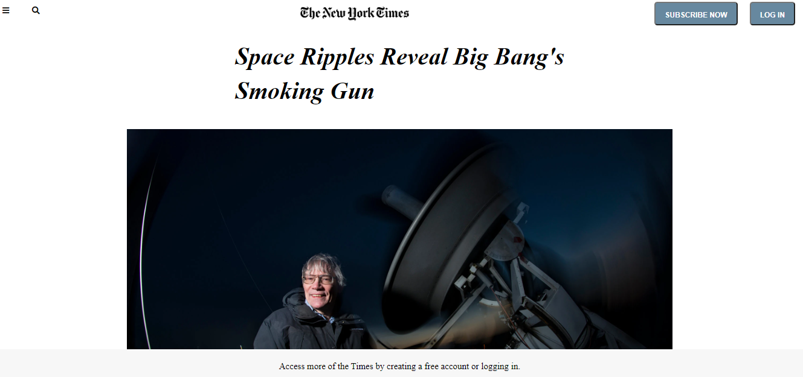

# New_York_Times_Article_Clone

The Microverse "Positioning and Floating Elements" practice that consist of creating a clone for the New York Times article https://www.nytimes.com/2014/03/18/science/space/detection-of-waves-in-space-buttresses-landmark-theory-of-big-bang.html?_r=0. 

## Built With
- HTML
- CSS
- font-awesome
- google api's font

## Authors
### Author1
- 👤GitHub: [Daniel Ufeli](https://github.com/danielufeli)

## Author2
- 👤GitHub: [Jose Abel Ramirez](https://github.com/jose-Abel)

## Getting Started
You can clone this code anytime and ust load the HTML on your browser since is a simple page build with HTML and CSS.

To get a local copy up and running follow these simple example steps.

## Live version
https://goofy-mcclintock-3497d8.netlify.app/

### Setup
You can either copy the code or just do a git pull on your computer.

### Run tests
We run the tests for the linters.yml file and everything pass!

### Acknowledgments
Appreciate the teams at Font Awesome and Google Font's API, helps coding amazing webpages faster.
Also an acknowledgment to Microverse for pushing us further to increase our knowledge.

## 📝 License
This project is MIT licensed.

## Show your support
Give a ⭐️ if you like this project!
